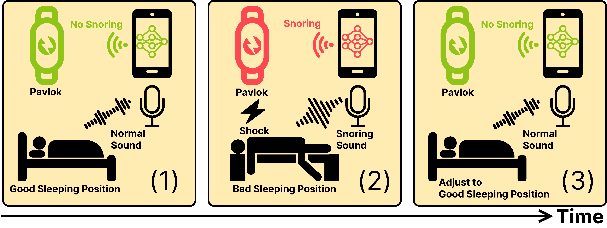

# Pavlok-Nudge: A Closed-Loop Framework for Real-Time Snore Detection and Wearable Feedback
**This repository includes the code and trained checkpoint of the AI model behind the above-mentioned paper, (to be) published in the _IEEE SMC 2026_ conference.**

    <!--  -->
    
    
    
    
    

&nbsp;

    

## Environment
This repository is developed and tested on the following environment:
- OS: SUSE Linux Enterprise Server 15 SP4
- Python 3.12.3, package are listed in `requirements.txt` and `requirements_toch_rocm.txt`, specific versions of major packages are:
    - torch==2.4.1+rocm6.1
    - torchaudio==2.4.1+rocm6.1
    - torchmetrics==1.4.1
    - pytorch-lightning==2.4.0
- ffmpeg 4.4.1, required for audio processing, installed in the OS. (If not installed, training/testing may raise a `RuntimeError: Couldn't find appropriate backend to handle uri some_file_name.wav and format None.`)

## Major Components
- [x] Snoring data Preprocessing
- [x] Deep learning model for snoring detection
- [x] Training and testing using Khan's dataset
- [x] Training and testing using MaleFemale dataset
- [x] Pretrained model checkpoints
